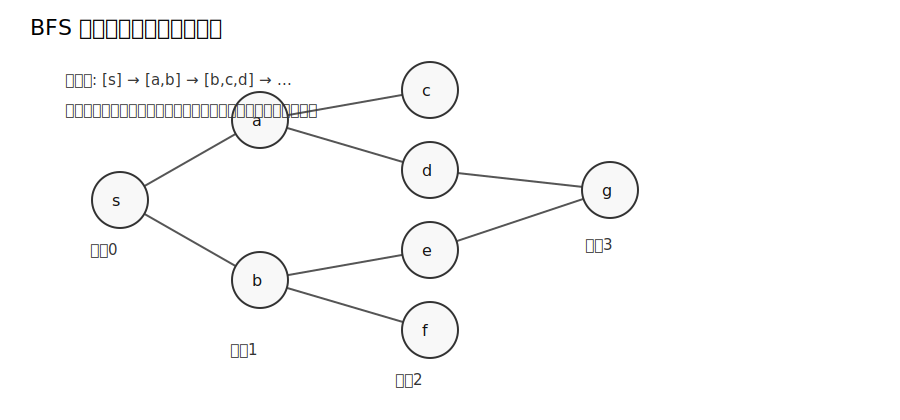
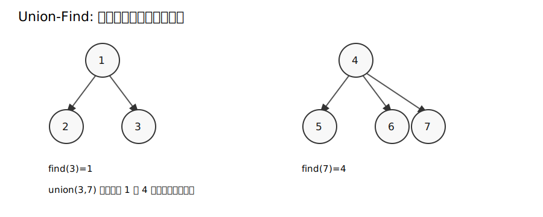
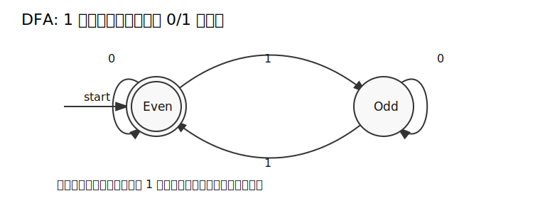
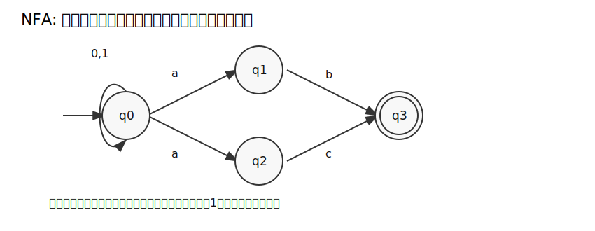

# 図表: グラフ・データ構造・オートマトン

## BFS は距離ごとに層を広げる



BFS では、始点からの距離が短い順に頂点が発見される。無重みグラフで最短距離を求められる理由は、キューが距離層の順序を保つからである。

確認すべき不変条件:

```text
キュー内の頂点は、すでに確定した距離 d または d+1 の層に属する。
```

## Union-Find



Union-Find は、各集合を代表元で管理する。`find(x)` は `x` が属する集合の代表元を返し、`union(x, y)` は代表元どうしを併合する。

理論上のポイントは、データ構造の状態が集合分割を表していることである。実装では木構造を使うが、意味論としては「同値関係の同値類」を管理している。

## DFA



DFA は、現在状態と入力記号から次状態が一意に決まる。上の例では、状態は「これまでに読んだ `1` の個数の偶奇」だけを記憶している。

形式的には次の5つ組で定義する。

```text
(Q, Σ, δ, q0, F)
```

| 記号 | 意味 |
|---|---|
| `Q` | 状態集合 |
| `Σ` | 入力アルファベット |
| `δ` | 遷移関数 |
| `q0` | 初期状態 |
| `F` | 受理状態集合 |

## NFA



NFA では、同じ状態・同じ入力記号から複数の遷移先があり得る。これはランダム選択ではない。可能な遷移をすべて同時に追跡し、受理状態へ到達する経路が一つでもあれば受理する。
