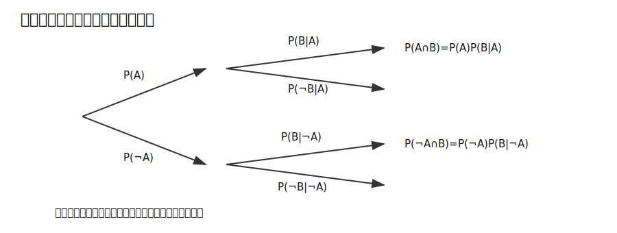
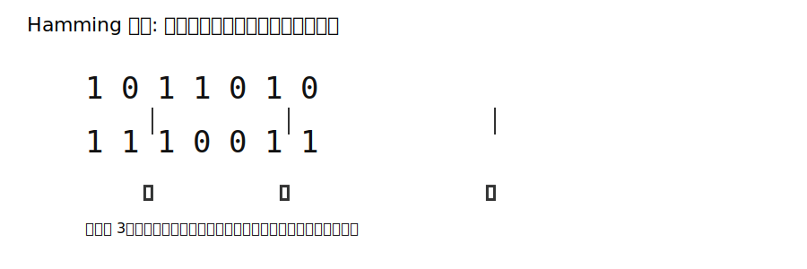
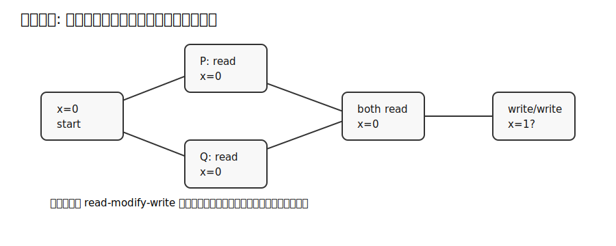

# 図表: 確率・符号・並行性

## 条件付き確率の確率木



条件付き確率は、分母となる条件で標本空間を制限する操作である。確率木では、枝を進むと掛け算になり、同じ事象へ至る枝を合計すると全確率になる。

基本公式:

```text
P(A ∩ B) = P(A)P(B|A)
P(B) = P(A)P(B|A) + P(¬A)P(B|¬A)
```

## Hamming距離



Hamming距離は、同じ長さの語について、位置ごとに比較して異なる箇所を数える。線形符号では、符号語間の最小距離が誤り検出・訂正能力を決める。

目安:

| 最小距離 `d` | 保証できる性質 |
|---|---|
| `d >= t + 1` | `t` 個までの誤り検出 |
| `d >= 2t + 1` | `t` 個までの誤り訂正 |

## 並行実行のインターリーブ



並行プログラムでは、各プロセスの局所的な命令順序は保たれていても、異なるプロセス間の実行順序は複数あり得る。これにより状態空間が急速に増える。

重要な区別:

| 概念 | 説明 |
|---|---|
| 非決定性 | 可能な遷移が複数あること |
| 確率性 | 遷移に確率分布があること |
| safety | 悪い状態に到達しないこと |
| liveness | 望ましい状態へいつか到達すること |
