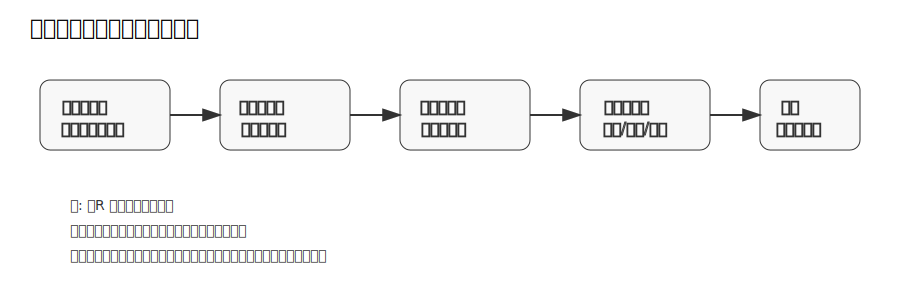
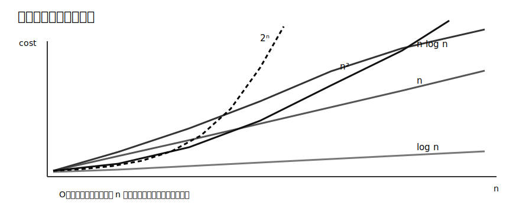
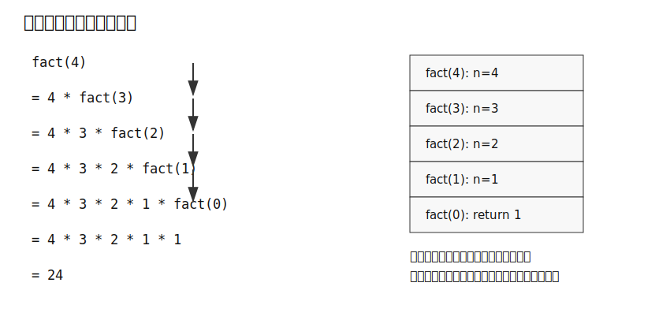
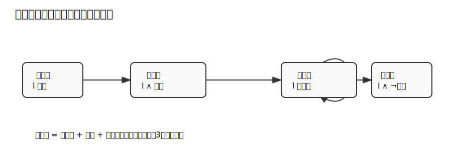

# 図表: 証明・漸近記法・再帰

## 証明を書くときの基本フロー



証明で最初に行うべきことは、使える仮定と示すべき結論を分離することである。定義を展開せずに「明らか」と書くと、証明の検査可能性が落ちる。

典型例:

```text
R が同値関係であることを示せ。
```

この場合、示すべきことは一つではない。反射律、対称律、推移律の三つである。各条件を定義から個別に示す。

## 代表的な成長率



漸近記法は、有限の小さい入力での大小ではなく、十分大きい入力での支配関係を見る。たとえば `1000n` は小さい `n` では `n^2` より大きく見えるが、漸近的には `n^2` の方が大きい。

チェックポイント:

- 定数倍は無視する。
- 低次項は無視する。
- 対数、多項式、指数の順序を混同しない。
- `O` は上界、`Ω` は下界、`Θ` は同じ次数を表す。

## 再帰呼び出しとスタック



再帰関数の理解では、次の二つを分ける。

1. 呼び出しが深くなる方向。
2. 基底部から値が戻る方向。

数学的帰納法の「基底部」と、再帰プログラムの「停止条件」は対応する。帰納法の「帰納ステップ」と、再帰呼び出し後に値を組み立てる処理が対応する。

## ループ不変条件



アルゴリズムの正しさを示すには、出力例を複数確認するだけでは不十分である。ループ不変条件を使う場合、少なくとも次を示す。

| 観点 | 示すこと |
|---|---|
| 初期化 | ループに入る前に不変条件が成り立つ |
| 保存 | 1回の反復で不変条件が壊れない |
| 終了 | 不変条件と終了条件から目的の性質が従う |
